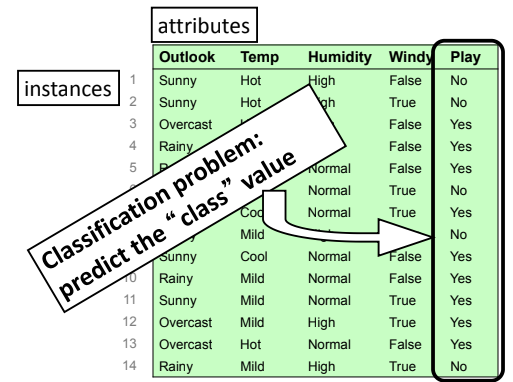
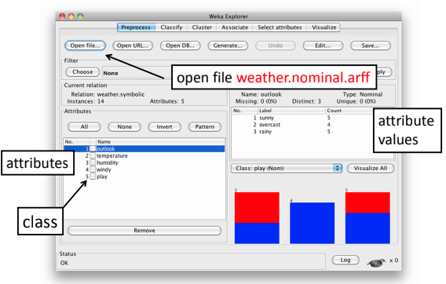

# Explore-Data-via-Weka

#### Ref: https://www.cs.waikato.ac.nz/ml/weka/courses.html 

# Data: weather.nominal

# Open file weather.nominal.arff

# Use a filter to remove an attribute

* Check the filters  
  - supervised vs unsupervised  
  - attribute vs instance  
* Choose the **unsupervised attribute** filter **Remove**
* Check the More information; look at the options
* Set **attributeIndices** to **3** and click OK
* Apply the filter
* Recall that you can Save the result
* Press Undo

# Exercise -1 
1. Remove instances where humidity is high

# Exercise -2
1. Download the data "trains-transformed.data" from https://archive.ics.uci.edu/ml/datasets/Trains 
2. Create an arff data version for Weka
3. Check whether it has missing values? If so, remove the instance that contain the missing values.

